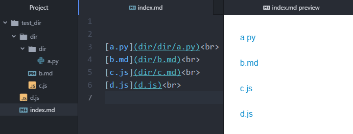

[English](README.md) | 한국어

# markdown_navigator

markdown_navigator는 여러분의 폴더 안의 모든 파일에 대해서  
편하게 이동할 수 있는 link를 만들어줍니다.

github과 같이 markdown을 사용하는 곳에서 빠르게 index를 만들기 위해 사용합니다.



## Installation 
```bash
$ npm install -g markdown_navigator
```
## Usage
```bash
$ mdnv create <directory> [options]
```
```bash
Usage: create <directory> [options]

creates a index.md to quickly navigate to all the files in your directory.

Options:
  -n, --name [name]  The name of the index file to be created. (default: "index")
  -h, --help         output usage information

  Examples:

    $ mdnv create ./directory
    $ mdnv create ./directory -n navi
```


### Basic
현재 있는 위치에서 모든 파일에 대해 이동이 가능한 index.md 파일을 생성합니다.
```
$ mdnv create
```


### Example  
**example directory**
```bash
test_directory
|-- file1.md
|-- dir1
|   |-- file2.md
|   |-- file3.md
|-- dir2
|   |-- file4.md
|   |-- file5.md
```
<br/>

**basic example**
```bash
$ cd test_folder/
$ mdnv create ./
```
다음과 같은 내용의 `index.md`파일이 생성됩니다.
```bash
[file1.md](/file1.md)  
[file2.md](/dir1/file2.md)  
[file3.md](/dir1/file3.md)  
[file4.md](/dir2/file4.md)  
[file5.md](/dir2/file5.md)
```
<br/>  

**option example**  
이번에는 `directory`과 `-n` 옵션을 추가한 예제입니다.
```bash
$ cd test_folder/
$ mdnv create dir1 -n menu
```
다음과 같은 내용의 `menu.md`파일이 생성됩니다.
```bash
[file2.md](/dir1/file2.md)
[file3.md](/dir1/file3.md)
```

## TODO
- 여러개의 폴더명을 입력하는 기능
```bash
$ mdnv create ./dir1 ./dir2
```
```bash
[file2.md](/dir1/file2.md)
[file3.md](/dir1/file3.md)
[file4.md](/dir2/file4.md)
[file5.md](/dir2/file5.md)
```

- index 파일이 생성될 경로를 지정하는 옵션
```bash
$ mdnv create ./dir1 -p ./other_directory
```

## Version

**현재 버전 : 0.3.0**  

[변경 내역](CHANGELOG.md)

## License

Licensed under [MIT License](LICENSE). © minung.han
